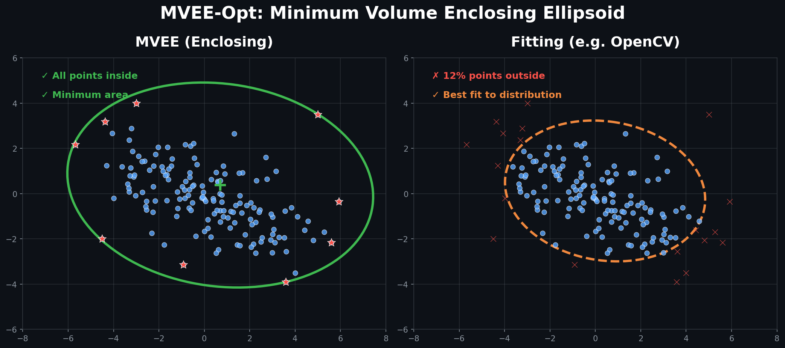
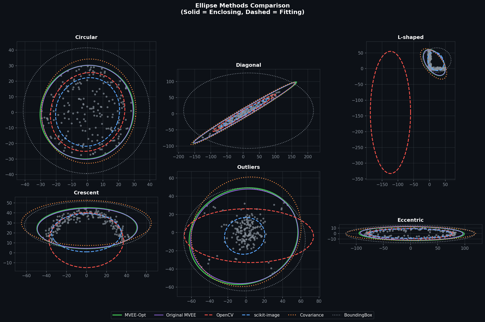

<!-- Keywords: MVEE, minimum volume enclosing ellipsoid, Löwner-John ellipsoid, 
Khachiyan algorithm, bounding ellipsoid, Python, NumPy, convex hull, core set,
computational geometry, point cloud, enclosing ellipse, optimal bounding box -->

# MVEE-Opt

**Fast Python Implementation of the Minimum Volume Enclosing Ellipsoid (MVEE)**

A production-ready, single-file Python implementation of the Minimum Volume Enclosing Ellipsoid algorithm (also known as the Löwner-John ellipsoid). Computes the smallest ellipsoid that contains all points in a given dataset using Khachiyan's dual formulation with optimized leverage score computation and convex hull preprocessing. Ideal for bounding regions in computer vision, computational geometry, and data analysis.



---

## What is MVEE?

The **Minimum Volume Enclosing Ellipsoid (MVEE)** is the smallest ellipsoid that completely contains a given set of points. Unlike fitting methods (OpenCV's `fitEllipse`, scikit-image's `EllipseModel`), MVEE *guarantees* all points lie inside or on the boundary.

**Use MVEE when you need:** Bounding regions, collision detection, segmentation masks, anomaly detection (points on boundary = potential outliers).

**Use fitting when you need:** Shape approximation, ellipse detection, statistical distribution modeling.

---

## Quick Start

Copy `mvee.py` into your project — it only requires NumPy.

```python
import numpy as np
from mvee import MVEE

# Your 2D points
points = np.random.randn(100, 2)

# Compute MVEE
solver = MVEE()
result = solver.fit(points)

# Access results
print(f"Center: {result.ellipse.center}")
print(f"Radii: {result.ellipse.radii}")  # [major, minor]
print(f"Rotation matrix: {result.ellipse.rotation}")
print(f"Core set size: {len(result.core_set_indices)}")  # Points on boundary
```

---

## Installation

### Minimal (just the module)

```bash
git clone https://github.com/TonyLuna/mvee-opt
cd mvee-opt
uv pip install numpy
```

### For running benchmarks

```bash
uv pip install numpy matplotlib scipy opencv-python scikit-image
mkdir -p media
python benchmark.py
```

---

## API Reference

### MVEE Class

```python
MVEE(tol=0.01, max_iter=200, use_convex_hull=True)
```

| Parameter | Type | Default | Description |
|-----------|------|---------|-------------|
| `tol` | float | 0.01 | Convergence tolerance (lower = more precise, slower) |
| `max_iter` | int | 200 | Maximum iterations (prevents infinite loops) |
| `use_convex_hull` | bool | True | Preprocess with convex hull (faster for large N) |

### MVEE.fit(points) → MVEEResult

| Input | Type | Description |
|-------|------|-------------|
| `points` | np.ndarray | Shape (N, d) array of N points in d dimensions |

### MVEEResult Fields

| Field | Type | Description |
|-------|------|-------------|
| `ellipse` | EllipseParams | Geometric parameters (center, radii, rotation, A) |
| `core_set_indices` | np.ndarray | Indices of points on ellipsoid boundary |
| `weights` | np.ndarray | Dual weights (non-zero = boundary points) |
| `iterations` | int | Number of iterations until convergence |
| `converged` | bool | True if converged before max_iter |

### EllipseParams Fields

| Field | Type | Description |
|-------|------|-------------|
| `center` | np.ndarray | Ellipsoid center (d,) |
| `radii` | np.ndarray | Semi-axis lengths, major first (d,) |
| `rotation` | np.ndarray | Rotation matrix (d, d) |
| `A` | np.ndarray | Shape matrix for constraint (x-c)ᵀA(x-c) ≤ 1 |

---

## How MVEE Works

### The Optimization Problem

MVEE solves:

```
maximize    log det(A)
subject to  (pᵢ - c)ᵀ A (pᵢ - c) ≤ 1    ∀ points pᵢ
            A ≻ 0  (positive definite)
```

This is equivalent to minimizing ellipsoid volume while enclosing all points.

### Khachiyan's Algorithm

We use Khachiyan's (1996) dual formulation, which iteratively:

1. Computes **leverage scores** Mᵢ = p̃ᵢᵀ V⁻¹ p̃ᵢ for each point
2. Finds the point j with maximum leverage (most "outside" current ellipsoid)
3. Updates weights to expand ellipsoid toward that point
4. Repeats until optimality condition max(M) ≤ d+1 is satisfied

### Key Optimizations

| Optimization | Complexity Impact | Description |
|--------------|-------------------|-------------|
| Einsum leverage computation | O(N²d) → O(Nd²) | Compute diagonal directly, not full matrix |
| Convex hull preprocessing | N → H vertices | MVEE(P) = MVEE(ConvexHull(P)) |
| Dual convergence criteria | Fewer iterations | KKT optimality + objective stagnation |
| Post-hoc enclosure check | Guarantees correctness | Scales ellipsoid if any point outside |

---

## Performance Benchmarks

Tested on 200 points, 2D, various distributions:

| Method | Avg. Time | Enclosure | Area Efficiency |
|--------|-----------|-----------|-----------------|
| **MVEE-Opt** | 1.5 ms | 100% ✓ | Optimal (1.0×) |
| Original Khachiyan | 10.4 ms | 100% ✓ | Optimal (1.0×) |
| Covariance + scale | 0.1 ms | 100% ✓ | 1.15-1.43× larger |
| Bounding box | 0.02 ms | ~100% ✓ | 1.2-10× larger |
| OpenCV fitEllipse | 0.05 ms | **0-90% ✗** | N/A (not enclosing) |
| scikit-image EllipseModel | 0.2 ms | **45-75% ✗** | N/A (not enclosing) |

**Key findings:**
- MVEE-Opt is **6-7× faster** than naive O(N²) implementations
- OpenCV/scikit-image solve a *different problem* (fitting, not enclosing)
- Covariance method is fast but produces 15-43% larger ellipsoids

Run benchmarks yourself:

```bash
mkdir -p media
python benchmark.py
```



---

## When to Use What?

| Problem | Solution |
|---------|----------|
| Bounding box for segmentation mask | ✅ **MVEE-Opt** |
| Collision detection bounds | ✅ **MVEE-Opt** |
| Outlier detection (boundary = outliers) | ✅ **MVEE-Opt** |
| Ellipse shape detection in images | ❌ Use OpenCV `fitEllipse` |
| Statistical distribution fitting | ❌ Use covariance ellipse |
| Real-time (>1000 FPS needed) | ❌ Use covariance + scaling |

---

## Mathematical Background

### Core Set Theory

**Theorem:** At most d(d+3)/2 points determine the MVEE. For 2D, that's just **5 points**.

The `core_set_indices` in the result identifies these boundary-defining points. This is useful for:
- Understanding which points "matter"
- Outlier detection (boundary points are extreme)
- Debugging unexpected ellipsoid shapes

### Why Convex Hull Preprocessing Works

**Lemma:** MVEE(P) = MVEE(ConvexHull(P))

*Proof:* Ellipsoids are convex. Any ellipsoid containing all hull vertices contains the entire hull (and thus all interior points). The minimum such ellipsoid is identical whether computed from P or its hull. ∎

This reduces N from thousands to typically 50-100 vertices.

---

## Frequently Asked Questions

### What is the difference between MVEE and fitEllipse?

**MVEE** finds the smallest ellipsoid that *contains* all points (enclosing). **fitEllipse** finds an ellipsoid that best *approximates* the point distribution (fitting). With fitEllipse, typically 30-50% of points lie outside the ellipse.

### Why is my ellipsoid much larger than expected?

Check for outliers. A single outlier far from the cluster will dramatically increase MVEE size. Consider:
1. Removing outliers first
2. Using the `core_set_indices` to identify boundary-defining points
3. Using covariance ellipse if you want a "typical" region, not a bound

### Can MVEE-Opt handle 3D or higher dimensions?

Yes. The algorithm is dimension-agnostic. However, convex hull preprocessing is only implemented for 2D. For d>2, set `use_convex_hull=False` or implement your own d-dimensional hull.

### How do I get the rotation angle (2D)?

```python
import numpy as np
result = solver.fit(points)
angle_rad = np.arctan2(result.ellipse.rotation[1, 0], 
                        result.ellipse.rotation[0, 0])
angle_deg = np.degrees(angle_rad)
```

---

## Implementation Notes

This implementation combines several known optimizations into a clean package:

1. **Einsum-based leverage scores** — `np.einsum('ij,jk,ik->i', Q, V_inv, Q)` computes only the diagonal elements needed, not the full N×N matrix

2. **Convex hull preprocessing** — Graham scan reduces point count before iteration

3. **Dual convergence criteria** — Checks both KKT optimality (max(M) ≤ d+1) and objective stagnation

4. **Numerical robustness** — Pseudoinverse fallback, eigenvalue flooring, step size clipping

5. **Guaranteed enclosure** — Post-hoc verification scales ellipsoid if any point lies outside (handles floating-point edge cases)

---

## References

1. **Khachiyan, L. G.** (1996). "Rounding of polytopes in the real number model of computation." *Mathematics of Operations Research*, 21(2), 307-320.

2. **Todd, M. J., & Yıldırım, E. A.** (2007). "On Khachiyan's algorithm for the computation of minimum-volume enclosing ellipsoids." *Discrete Applied Mathematics*, 155(13), 1731-1744.

3. **Kumar, P., & Yıldırım, E. A.** (2005). "Minimum-volume enclosing ellipsoids and core sets." *Journal of Optimization Theory and Applications*, 126(1), 1-21.

4. **Moshtagh, N.** (2005). "Minimum volume enclosing ellipsoid." MATLAB Central File Exchange.

5. **Bowman, N., & Heath, M. T.** (2023). "Computing minimum-volume enclosing ellipsoids." *Mathematical Programming Computation*, 15, 621-650.

---

## License

MIT License — see [LICENSE](LICENSE)

---

## Author

**TonyLuna** — January 2026

Contributions welcome. Fork it, improve it, use it.